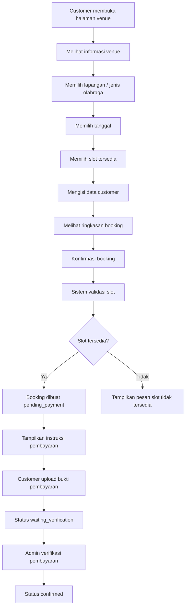
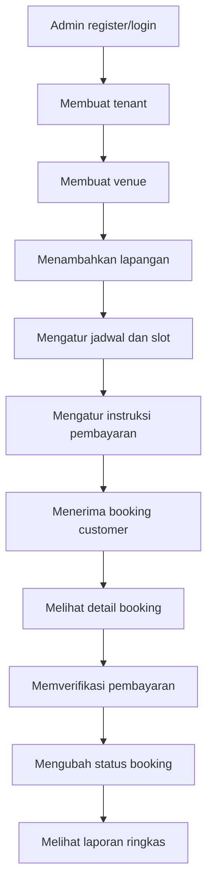
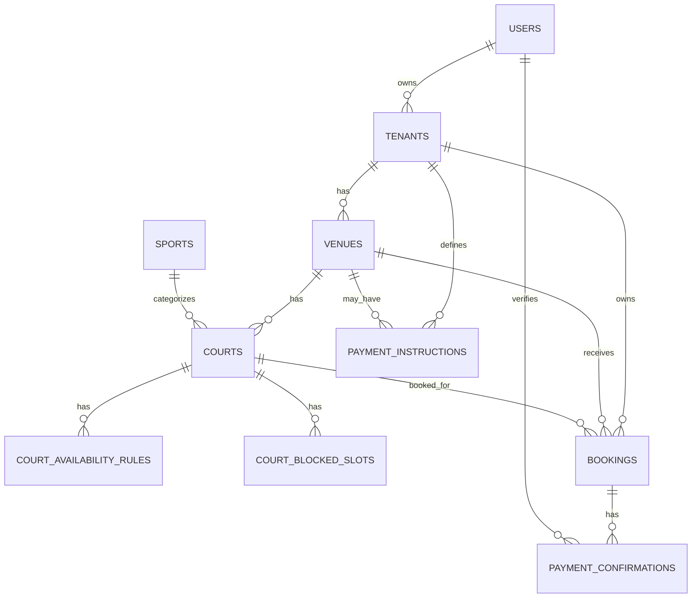

# PRD — Courva

## 1. Overview

**Courva** adalah platform booking lapangan olahraga berbasis web untuk pengguna Indonesia. Aplikasi ini dirancang sebagai sistem **multitenant**, sehingga setiap pemilik venue atau admin bisnis dapat memiliki akun sendiri, mengelola banyak venue, mengelola banyak lapangan, mengatur jadwal ketersediaan, menerima booking dari customer publik, serta memverifikasi pembayaran manual.

Courva tidak menggunakan fitur AI di dalam aplikasinya. Fokus produk adalah showcase aplikasi full-stack modern yang simple, rapi, dan terlihat profesional untuk kebutuhan portofolio AI coding.

### 1.1 Masalah yang Diselesaikan

Banyak pemilik lapangan olahraga di Indonesia masih mengelola booking secara manual melalui WhatsApp, catatan admin, atau spreadsheet. Pola ini menimbulkan beberapa masalah:

- Customer harus bertanya manual kepada admin untuk mengetahui slot yang tersedia.
- Admin berisiko mencatat jadwal ganda pada lapangan, tanggal, dan jam yang sama.
- Proses pembayaran dan verifikasi masih tersebar di chat pribadi.
- Pemilik venue sulit memantau booking, pendapatan estimasi, dan status pembayaran.
- Customer tidak memiliki halaman booking yang jelas, ringkas, dan mudah digunakan.

### 1.2 Tujuan Produk

Tujuan utama Courva adalah menyediakan platform booking lapangan olahraga yang mudah digunakan oleh pemilik venue dan customer publik.

Tujuan utama aplikasi:

- Menyediakan landing page utama untuk memperkenalkan Courva.
- Menyediakan halaman publik untuk setiap venue.
- Memungkinkan customer melakukan booking tanpa login.
- Memungkinkan admin tenant mengelola venue, lapangan, jadwal, booking, dan pembayaran manual.
- Mencegah double booking pada slot lapangan yang sama.
- Memberikan pengalaman booking yang mobile-friendly untuk pengguna Indonesia.
- Menjadi showcase aplikasi full-stack modern dengan UI sporty dan profesional.

### 1.3 Target Pengguna

Courva ditujukan untuk:

- Pemilik venue olahraga.
- Admin atau staff venue olahraga.
- Customer publik yang ingin booking lapangan.
- Komunitas olahraga.
- Pengguna Indonesia yang terbiasa melakukan reservasi melalui smartphone.

### 1.4 Jenis Olahraga yang Didukung

Courva mendukung konsep **multi-olahraga**, sehingga satu platform dapat digunakan untuk berbagai jenis lapangan, seperti:

- Futsal
- Badminton
- Mini soccer
- Basket
- Tenis
- Padel
- Voli
- Jenis olahraga lain yang dapat ditambahkan oleh admin

---

## 2. Product Scope

### 2.1 MVP Scope

Fitur yang wajib ada pada versi MVP:

- Landing page utama Courva.
- Registrasi dan login admin tenant.
- Dashboard admin tenant.
- Manajemen venue.
- Manajemen lapangan multi-olahraga.
- Manajemen jadwal dan slot booking.
- Halaman publik venue.
- Booking customer tanpa login.
- Kode booking dan halaman detail booking.
- Instruksi pembayaran manual.
- Upload bukti pembayaran.
- Verifikasi pembayaran oleh admin.
- Manajemen status booking.
- Pencegahan double booking.
- Link WhatsApp untuk komunikasi customer dan admin.
- Responsive design/mobile-friendly.

### 2.2 Out of Scope untuk MVP

Fitur berikut tidak wajib pada versi awal:

- Payment gateway otomatis.
- Login customer.
- Mobile app native.
- WhatsApp Business API.
- Subdomain khusus per tenant.
- Sistem subscription berbayar.
- Promo, voucher, dan membership.
- Dynamic pricing kompleks.
- Integrasi Google Maps API.
- Real-time WebSocket.
- Multi-staff permission detail.

### 2.3 Future Enhancement

Fitur lanjutan yang dapat dikembangkan:

- Payment gateway Midtrans/Xendit.
- WhatsApp Business API untuk notifikasi otomatis.
- PostgreSQL untuk production-ready multitenant.
- Subdomain per tenant, misalnya `namavenuemu.courva.id`.
- Role staff untuk tenant.
- Super Admin penuh untuk pengelolaan platform.
- Harga weekday/weekend dan prime time.
- Laporan pendapatan lanjutan.
- Rating dan review venue.
- Venue favorit.
- Kalender real-time.
- Reminder otomatis sebelum jadwal bermain.

---

## 3. User Roles

### 3.1 Guest / Customer Publik

Customer publik adalah pengguna yang dapat membuka halaman venue dan melakukan booking tanpa login.

Hak akses customer publik:

- Melihat landing page utama.
- Melihat halaman publik venue.
- Melihat daftar lapangan.
- Melihat jadwal slot tersedia.
- Melakukan booking tanpa akun.
- Mengisi data booking.
- Melihat instruksi pembayaran manual.
- Upload bukti pembayaran.
- Membuka detail booking melalui link unik.
- Menghubungi venue melalui link WhatsApp.

### 3.2 Admin Tenant / Owner Venue

Admin tenant adalah pengguna yang memiliki akun untuk mengelola bisnis/venue miliknya.

Hak akses admin tenant:

- Login ke dashboard.
- Mengelola profil tenant.
- Mengelola satu atau banyak venue.
- Mengelola lapangan pada setiap venue.
- Mengatur jenis olahraga, harga, dan status lapangan.
- Mengatur jam operasional dan slot booking.
- Melihat booking masuk.
- Mengubah status booking.
- Memverifikasi pembayaran manual.
- Mengelola instruksi pembayaran.
- Melihat ringkasan booking dan estimasi pendapatan.

### 3.3 Super Admin Platform

Super Admin adalah role opsional untuk fase lanjutan.

Hak akses Super Admin:

- Melihat seluruh tenant.
- Melihat seluruh venue.
- Menonaktifkan tenant atau venue.
- Mengelola kategori olahraga.
- Melihat statistik platform.
- Membantu moderasi data platform.

Pada MVP, Super Admin dapat dibuat sederhana atau ditunda.

---

## 4. Core Features

## 4.1 Landing Page Utama Courva

Landing page utama berfungsi untuk memperkenalkan Courva sebagai platform booking lapangan olahraga untuk pemilik venue.

### Konten utama landing page:

- Hero section
- Problem section
- Solution section
- Feature highlight
- Cara kerja
- Use case olahraga
- Preview dashboard
- CTA daftar sebagai pemilik venue
- FAQ
- Footer

### Tujuan landing page:

- Menarik pemilik venue untuk menggunakan Courva.
- Menjelaskan masalah booking manual.
- Menunjukkan manfaat jadwal online dan pembayaran manual yang terstruktur.
- Mengarahkan pengguna ke halaman demo atau registrasi admin.

---

## 4.2 Authentication Admin

Customer tidak perlu login. Login hanya digunakan untuk admin tenant.

### Fitur authentication:

- Register admin tenant.
- Login admin.
- Logout admin.
- Session management.
- Proteksi route dashboard.
- Penyimpanan password secara aman melalui Better Auth.

### Setelah register:

Admin diarahkan untuk membuat profil tenant dan venue pertama.

---

## 4.3 Tenant Management

Tenant merepresentasikan bisnis atau pemilik venue.

### Data tenant:

- Nama bisnis
- Slug tenant
- Email admin
- Nomor WhatsApp bisnis
- Logo opsional
- Status aktif

### Aturan tenant:

- Satu user admin utama memiliki satu tenant pada MVP.
- Satu tenant dapat memiliki banyak venue.
- Semua venue, lapangan, booking, dan payment instruction terhubung ke tenant.
- Admin tenant hanya dapat mengakses data miliknya sendiri.

---

## 4.4 Venue Management

Venue adalah lokasi bisnis olahraga yang dimiliki tenant.

### Fitur venue:

- Tambah venue.
- Edit venue.
- Nonaktifkan venue.
- Upload foto venue.
- Atur alamat dan kota.
- Atur deskripsi venue.
- Atur nomor WhatsApp venue.
- Atur jam operasional default.
- Atur slug halaman publik.

### Data venue:

- Nama venue
- Slug venue
- Alamat lengkap
- Kota
- Deskripsi
- Foto
- Nomor WhatsApp
- Jam buka
- Jam tutup
- Status aktif/nonaktif

### Public URL:

Format halaman publik yang digunakan:

```txt
/venue/:venueSlug
```

Contoh:

```txt
/venue/arena-sport-center
```

---

## 4.5 Court / Field Management

Lapangan adalah unit yang dapat dibooking oleh customer.

### Fitur lapangan:

- Tambah lapangan.
- Edit lapangan.
- Nonaktifkan lapangan.
- Menentukan jenis olahraga.
- Menentukan harga per jam.
- Upload foto lapangan.
- Menentukan status aktif/nonaktif.

### Data lapangan:

- Nama lapangan
- Venue terkait
- Jenis olahraga
- Deskripsi
- Harga per jam
- Foto
- Status aktif/nonaktif

### Contoh nama lapangan:

- Court A
- Futsal 1
- Badminton 2
- Mini Soccer Premium
- Basket Indoor

---

## 4.6 Schedule & Slot Management

Jadwal digunakan untuk menentukan kapan lapangan dapat dibooking.

### Fitur jadwal:

- Atur jam operasional per lapangan.
- Atur hari aktif.
- Atur durasi slot default.
- Menutup slot tertentu untuk maintenance.
- Melihat slot tersedia dan slot terisi.
- Mencegah double booking.

### Aturan slot MVP:

- Admin menentukan durasi slot default, misalnya 60 menit.
- Customer dapat booking satu atau beberapa slot berurutan.
- Sistem menghitung total durasi dan total harga.
- Slot yang sudah dibooking dengan status aktif tidak dapat dipilih lagi.

### Status slot:

Slot dianggap tidak tersedia jika terdapat booking dengan status:

- `pending_payment`
- `waiting_verification`
- `confirmed`

Slot dapat kembali tersedia jika booking dibatalkan atau expired.

---

## 4.7 Public Venue Page

Halaman publik venue digunakan customer untuk melihat venue dan melakukan booking tanpa login.

### Konten halaman publik:

- Nama venue
- Foto venue
- Alamat
- Kota
- Nomor WhatsApp
- Jam operasional
- Deskripsi
- Daftar lapangan
- Filter jenis olahraga
- Kalender tanggal
- Slot tersedia
- CTA booking

### Prinsip halaman publik:

- Mobile-first.
- Ringkas dan mudah dipahami.
- Customer tidak perlu membuat akun.
- Informasi slot harus jelas.
- Tombol booking harus mudah ditemukan.

---

## 4.8 Public Booking Flow

Customer dapat melakukan booking tanpa login.

### Data yang diisi customer:

- Nama lengkap
- Nomor WhatsApp
- Venue
- Lapangan
- Tanggal
- Jam mulai
- Durasi
- Catatan opsional

### Alur booking customer:

1. Customer membuka halaman publik venue.
2. Customer memilih jenis olahraga atau lapangan.
3. Customer memilih tanggal.
4. Customer melihat slot yang tersedia.
5. Customer memilih jam dan durasi.
6. Customer mengisi nama dan nomor WhatsApp.
7. Customer melihat ringkasan booking.
8. Customer menekan tombol konfirmasi booking.
9. Sistem memvalidasi slot agar tidak terjadi double booking.
10. Sistem membuat booking dengan status `pending_payment`.
11. Sistem membuat kode booking dan link detail booking.
12. Customer melihat instruksi pembayaran manual.
13. Customer melakukan pembayaran.
14. Customer upload bukti pembayaran.
15. Admin memverifikasi pembayaran.
16. Status booking berubah menjadi `confirmed`.

---

## 4.9 Booking Detail Page

Karena customer tidak login, customer harus dapat membuka detail booking menggunakan link unik.

### Format URL:

```txt
/booking/:bookingCode
```

Contoh:

```txt
/booking/CV-2026-0001
```

### Isi halaman detail booking:

- Kode booking
- Nama venue
- Nama lapangan
- Jenis olahraga
- Tanggal booking
- Jam mulai dan selesai
- Durasi
- Total harga
- Status booking
- Instruksi pembayaran
- Upload bukti pembayaran
- Tombol WhatsApp admin

### Keamanan dasar:

- Booking code harus unik dan tidak mudah ditebak.
- Data sensitif customer tidak ditampilkan berlebihan.
- Customer hanya melihat detail booking berdasarkan kode booking.

---

## 4.10 Manual Payment

Pembayaran MVP dilakukan secara manual.

### Metode pembayaran MVP:

- Transfer bank
- QRIS
- Upload bukti pembayaran
- Bayar di tempat sebagai opsi tambahan

### Data instruksi pembayaran:

- Metode pembayaran
- Nama bank
- Nomor rekening
- Nama pemilik rekening
- Gambar QRIS
- Instruksi tambahan
- Status aktif/nonaktif

### Alur pembayaran manual:

1. Customer menyelesaikan booking.
2. Sistem menampilkan instruksi pembayaran.
3. Customer melakukan transfer/QRIS.
4. Customer upload bukti pembayaran.
5. Booking berubah menjadi `waiting_verification`.
6. Admin melihat bukti pembayaran.
7. Admin menyetujui atau menolak pembayaran.
8. Jika disetujui, booking menjadi `confirmed`.
9. Jika ditolak, booking kembali membutuhkan pembayaran ulang atau dibatalkan.

---

## 4.11 Admin Dashboard

Dashboard admin digunakan tenant untuk mengelola operasional venue.

### Ringkasan dashboard:

- Total booking hari ini
- Booking mendatang
- Booking pending payment
- Booking waiting verification
- Booking confirmed
- Estimasi pendapatan bulan ini
- Lapangan aktif
- Venue aktif

### Quick actions:

- Tambah venue
- Tambah lapangan
- Lihat booking masuk
- Verifikasi pembayaran
- Atur instruksi pembayaran

---

## 4.12 Booking Management

Admin dapat melihat dan mengelola booking.

### Fitur booking management:

- List booking.
- Filter berdasarkan venue.
- Filter berdasarkan lapangan.
- Filter berdasarkan tanggal.
- Filter berdasarkan status.
- Detail booking.
- Ubah status booking.
- Verifikasi pembayaran.
- Batalkan booking.
- Tandai booking selesai.
- Link WhatsApp customer.

### Status booking:

- `pending_payment`: booking dibuat, customer belum upload bukti pembayaran.
- `waiting_verification`: customer sudah upload bukti pembayaran, menunggu admin.
- `confirmed`: pembayaran sudah diverifikasi atau booking disetujui.
- `cancelled`: booking dibatalkan.
- `completed`: booking selesai.
- `expired`: booking otomatis kedaluwarsa karena tidak dibayar dalam batas waktu.

### Booking expiration:

Untuk MVP, booking `pending_payment` dapat dibuat expired secara manual oleh admin. Untuk versi lanjutan, sistem dapat membuat booking expired otomatis setelah batas waktu tertentu, misalnya 60 menit.

---

## 4.13 WhatsApp Link Integration

Courva tidak perlu WhatsApp Business API pada MVP. Sistem cukup menyediakan link WhatsApp.

### Fitur WhatsApp:

- Tombol hubungi venue dari halaman publik.
- Tombol hubungi admin pada halaman detail booking.
- Tombol hubungi customer dari dashboard admin.
- Template pesan otomatis melalui URL WhatsApp.

### Contoh pesan customer ke admin:

```txt
Halo Admin, saya ingin konfirmasi booking dengan kode CV-2026-0001.
```

---

## 5. User Flow

## 5.1 Customer Public Booking Flow



## 5.2 Admin Tenant Flow



---

## 6. Functional Requirements

| Kode | Requirement | Role |
|---|---|---|
| FR-01 | Sistem menyediakan landing page utama Courva. | Guest |
| FR-02 | Sistem menyediakan registrasi dan login admin tenant. | Admin Tenant |
| FR-03 | Sistem memungkinkan admin membuat dan mengelola profil tenant. | Admin Tenant |
| FR-04 | Sistem memungkinkan admin mengelola banyak venue. | Admin Tenant |
| FR-05 | Sistem memungkinkan admin mengelola banyak lapangan pada setiap venue. | Admin Tenant |
| FR-06 | Sistem mendukung kategori olahraga multi-olahraga. | Admin Tenant |
| FR-07 | Sistem memungkinkan admin mengatur harga per jam setiap lapangan. | Admin Tenant |
| FR-08 | Sistem memungkinkan admin mengatur jadwal dan slot booking. | Admin Tenant |
| FR-09 | Sistem menyediakan halaman publik venue. | Guest |
| FR-10 | Sistem memungkinkan customer booking tanpa login. | Customer Publik |
| FR-11 | Sistem menampilkan slot tersedia berdasarkan tanggal dan lapangan. | Customer Publik |
| FR-12 | Sistem menghitung total harga berdasarkan durasi booking. | Customer Publik |
| FR-13 | Sistem mencegah double booking pada lapangan, tanggal, dan jam yang sama. | Sistem |
| FR-14 | Sistem membuat kode booking unik. | Sistem |
| FR-15 | Sistem menyediakan halaman detail booking publik berdasarkan kode booking. | Customer Publik |
| FR-16 | Sistem menampilkan instruksi pembayaran manual. | Customer Publik |
| FR-17 | Sistem memungkinkan customer upload bukti pembayaran. | Customer Publik |
| FR-18 | Sistem mengubah status booking menjadi waiting_verification setelah bukti pembayaran dikirim. | Sistem |
| FR-19 | Sistem memungkinkan admin memverifikasi pembayaran manual. | Admin Tenant |
| FR-20 | Sistem memungkinkan admin mengubah status booking. | Admin Tenant |
| FR-21 | Sistem menyediakan dashboard ringkasan booking dan pendapatan estimasi. | Admin Tenant |
| FR-22 | Sistem menyediakan link WhatsApp untuk komunikasi admin dan customer. | Customer/Admin |
| FR-23 | Sistem menjaga isolasi data antar tenant. | Sistem |
| FR-24 | Sistem memungkinkan upload foto venue, foto lapangan, QRIS, dan bukti pembayaran. | Admin/Customer |

---

## 7. Non-Functional Requirements

| Kode | Requirement | Penjelasan |
|---|---|---|
| NFR-01 | Mobile-friendly | Aplikasi harus nyaman digunakan dari smartphone. |
| NFR-02 | Responsive layout | Landing page, halaman publik, dan dashboard harus menyesuaikan desktop/tablet/mobile. |
| NFR-03 | Tenant isolation | Data tenant tidak boleh terlihat atau termodifikasi oleh tenant lain. |
| NFR-04 | Secure authentication | Login admin harus menggunakan mekanisme auth yang aman. |
| NFR-05 | Input validation | Semua input form harus divalidasi di client dan server. |
| NFR-06 | Double booking protection | Validasi slot harus dilakukan di server sebelum booking dibuat. |
| NFR-07 | Clear booking status | Status booking harus jelas dan konsisten. |
| NFR-08 | Maintainable codebase | Struktur kode harus modular dan mudah dikembangkan. |
| NFR-09 | Accessible UI | Warna, kontras, label form, dan navigasi harus mudah digunakan. |
| NFR-10 | Fast page loading | Halaman publik harus ringan dan cepat diakses. |
| NFR-11 | SEO-friendly landing page | Landing page utama dan halaman publik venue sebaiknya mudah diindeks. |
| NFR-12 | Auditability | Perubahan status booking dan pembayaran sebaiknya dapat dilacak minimal melalui timestamp. |

---

## 8. Page Screen List

## 8.1 Public Pages

| Halaman | URL | Fungsi |
|---|---|---|
| Landing Page | `/` | Memperkenalkan Courva dan CTA daftar admin |
| Venue Public Page | `/venue/:venueSlug` | Menampilkan profil venue dan daftar lapangan |
| Booking Form | `/venue/:venueSlug/book/:courtId` | Form pemilihan slot dan data customer |
| Booking Detail | `/booking/:bookingCode` | Detail booking, status, pembayaran, upload bukti |
| Login Admin | `/login` | Login admin tenant |
| Register Admin | `/register` | Registrasi pemilik venue |

## 8.2 Admin Pages

| Halaman | URL | Fungsi |
|---|---|---|
| Dashboard | `/dashboard` | Ringkasan operasional |
| Tenant Settings | `/dashboard/settings` | Pengaturan tenant |
| Venue List | `/dashboard/venues` | Daftar venue |
| Venue Form | `/dashboard/venues/new` dan `/dashboard/venues/:id/edit` | Tambah/edit venue |
| Court List | `/dashboard/courts` | Daftar lapangan |
| Court Form | `/dashboard/courts/new` dan `/dashboard/courts/:id/edit` | Tambah/edit lapangan |
| Schedule Management | `/dashboard/schedules` | Kelola jadwal dan slot |
| Booking List | `/dashboard/bookings` | Daftar booking |
| Booking Detail | `/dashboard/bookings/:id` | Detail booking dan status |
| Payment Instructions | `/dashboard/payments/instructions` | Kelola metode pembayaran manual |
| Payment Verification | `/dashboard/payments/verifications` | Verifikasi bukti pembayaran |
| Reports | `/dashboard/reports` | Laporan ringkas booking dan pendapatan |

---

## 9. Data Model / Database Schema

Database menggunakan SQLite untuk MVP/demo. Jika dikembangkan ke production, database dapat dinaikkan ke PostgreSQL.

## 9.1 `users`

Menyimpan data admin atau pemilik venue.

| Field | Type | Keterangan |
|---|---|---|
| id | text/uuid | ID unik user |
| name | text | Nama admin |
| email | text | Email login |
| password_hash | text | Hash password jika diperlukan |
| created_at | datetime | Waktu dibuat |
| updated_at | datetime | Waktu diperbarui |

## 9.2 `tenants`

Menyimpan entitas bisnis pemilik venue.

| Field | Type | Keterangan |
|---|---|---|
| id | text/uuid | ID unik tenant |
| owner_user_id | text/uuid | Relasi ke user pemilik |
| name | text | Nama bisnis |
| slug | text | Slug tenant |
| logo_url | text nullable | Logo bisnis |
| whatsapp_number | text | Nomor WhatsApp bisnis |
| is_active | boolean | Status tenant |
| created_at | datetime | Waktu dibuat |
| updated_at | datetime | Waktu diperbarui |

## 9.3 `venues`

Menyimpan lokasi venue olahraga.

| Field | Type | Keterangan |
|---|---|---|
| id | text/uuid | ID unik venue |
| tenant_id | text/uuid | Relasi ke tenant |
| name | text | Nama venue |
| slug | text | Slug URL publik |
| address | text | Alamat lengkap |
| city | text | Kota |
| description | text | Deskripsi venue |
| phone_whatsapp | text | Nomor WhatsApp venue |
| photo_url | text nullable | Foto venue |
| open_time | text/time | Jam buka default |
| close_time | text/time | Jam tutup default |
| is_active | boolean | Status aktif |
| created_at | datetime | Waktu dibuat |
| updated_at | datetime | Waktu diperbarui |

## 9.4 `sports`

Menyimpan kategori olahraga.

| Field | Type | Keterangan |
|---|---|---|
| id | text/uuid | ID unik olahraga |
| name | text | Nama olahraga |
| slug | text | Slug olahraga |
| icon | text nullable | Nama icon |
| is_active | boolean | Status aktif |

## 9.5 `courts`

Menyimpan data lapangan.

| Field | Type | Keterangan |
|---|---|---|
| id | text/uuid | ID unik lapangan |
| venue_id | text/uuid | Relasi ke venue |
| sport_id | text/uuid | Relasi ke olahraga |
| name | text | Nama lapangan |
| description | text | Deskripsi lapangan |
| price_per_hour | integer | Harga per jam |
| photo_url | text nullable | Foto lapangan |
| is_active | boolean | Status aktif |
| created_at | datetime | Waktu dibuat |
| updated_at | datetime | Waktu diperbarui |

## 9.6 `court_availability_rules`

Menyimpan aturan ketersediaan lapangan.

| Field | Type | Keterangan |
|---|---|---|
| id | text/uuid | ID unik aturan |
| court_id | text/uuid | Relasi ke lapangan |
| day_of_week | integer | 0 Minggu sampai 6 Sabtu |
| start_time | text/time | Jam mulai |
| end_time | text/time | Jam selesai |
| slot_duration_minutes | integer | Durasi slot |
| is_active | boolean | Status aktif |

## 9.7 `court_blocked_slots`

Menyimpan slot yang ditutup manual, misalnya maintenance.

| Field | Type | Keterangan |
|---|---|---|
| id | text/uuid | ID unik blocked slot |
| court_id | text/uuid | Relasi ke lapangan |
| date | date | Tanggal ditutup |
| start_time | text/time | Jam mulai |
| end_time | text/time | Jam selesai |
| reason | text nullable | Alasan penutupan |
| created_at | datetime | Waktu dibuat |

## 9.8 `bookings`

Menyimpan data booking customer.

| Field | Type | Keterangan |
|---|---|---|
| id | text/uuid | ID unik booking |
| booking_code | text | Kode booking unik |
| tenant_id | text/uuid | Relasi ke tenant |
| venue_id | text/uuid | Relasi ke venue |
| court_id | text/uuid | Relasi ke lapangan |
| customer_name | text | Nama customer |
| customer_phone | text | Nomor WhatsApp customer |
| booking_date | date | Tanggal booking |
| start_time | text/time | Jam mulai |
| end_time | text/time | Jam selesai |
| duration_minutes | integer | Durasi booking |
| total_price | integer | Total harga |
| status | text | Status booking |
| notes | text nullable | Catatan |
| created_at | datetime | Waktu dibuat |
| updated_at | datetime | Waktu diperbarui |

## 9.9 `payment_instructions`

Menyimpan instruksi pembayaran manual.

| Field | Type | Keterangan |
|---|---|---|
| id | text/uuid | ID unik instruksi |
| tenant_id | text/uuid | Relasi ke tenant |
| venue_id | text/uuid nullable | Relasi ke venue jika khusus |
| method | text | bank_transfer/qris/cash |
| account_name | text nullable | Nama pemilik rekening |
| account_number | text nullable | Nomor rekening |
| bank_name | text nullable | Nama bank |
| qris_image_url | text nullable | Gambar QRIS |
| instructions | text | Instruksi tambahan |
| is_active | boolean | Status aktif |

## 9.10 `payment_confirmations`

Menyimpan konfirmasi pembayaran manual.

| Field | Type | Keterangan |
|---|---|---|
| id | text/uuid | ID unik konfirmasi |
| booking_id | text/uuid | Relasi ke booking |
| proof_image_url | text nullable | Bukti pembayaran |
| confirmed_by_user_id | text/uuid nullable | Admin yang memverifikasi |
| confirmed_at | datetime nullable | Waktu verifikasi |
| status | text | submitted/approved/rejected |
| notes | text nullable | Catatan verifikasi |
| created_at | datetime | Waktu dibuat |

## 9.11 ERD



---

## 10. API Routes

API dibuat menggunakan API routes di dalam satu project Next.js.

## 10.1 Public API

| Method | Endpoint | Fungsi |
|---|---|---|
| GET | `/api/public/venues/:slug` | Mengambil detail venue publik |
| GET | `/api/public/venues/:slug/courts` | Mengambil daftar lapangan venue |
| GET | `/api/public/courts/:courtId/slots` | Mengambil slot tersedia berdasarkan tanggal |
| POST | `/api/public/bookings` | Membuat booking customer |
| GET | `/api/public/bookings/:bookingCode` | Mengambil detail booking |
| POST | `/api/public/bookings/:bookingCode/payment-proof` | Upload bukti pembayaran |

## 10.2 Admin API

| Method | Endpoint | Fungsi |
|---|---|---|
| GET | `/api/admin/dashboard` | Ringkasan dashboard |
| GET | `/api/admin/tenant` | Detail tenant |
| PATCH | `/api/admin/tenant` | Update tenant |
| GET | `/api/admin/venues` | List venue tenant |
| POST | `/api/admin/venues` | Tambah venue |
| GET | `/api/admin/venues/:id` | Detail venue |
| PATCH | `/api/admin/venues/:id` | Update venue |
| DELETE | `/api/admin/venues/:id` | Nonaktifkan venue |
| GET | `/api/admin/courts` | List lapangan |
| POST | `/api/admin/courts` | Tambah lapangan |
| PATCH | `/api/admin/courts/:id` | Update lapangan |
| DELETE | `/api/admin/courts/:id` | Nonaktifkan lapangan |
| GET | `/api/admin/schedules` | List aturan jadwal |
| POST | `/api/admin/schedules` | Tambah aturan jadwal |
| PATCH | `/api/admin/schedules/:id` | Update aturan jadwal |
| DELETE | `/api/admin/schedules/:id` | Nonaktifkan aturan jadwal |
| POST | `/api/admin/blocked-slots` | Tutup slot manual |
| GET | `/api/admin/bookings` | List booking |
| GET | `/api/admin/bookings/:id` | Detail booking |
| PATCH | `/api/admin/bookings/:id/status` | Ubah status booking |
| GET | `/api/admin/payment-instructions` | List instruksi pembayaran |
| POST | `/api/admin/payment-instructions` | Tambah instruksi pembayaran |
| PATCH | `/api/admin/payment-instructions/:id` | Update instruksi pembayaran |
| POST | `/api/admin/payment-confirmations/:id/approve` | Setujui pembayaran |
| POST | `/api/admin/payment-confirmations/:id/reject` | Tolak pembayaran |

---

## 11. Business Rules

## 11.1 Double Booking

Sistem harus mencegah booking ganda pada lapangan, tanggal, dan waktu yang bertabrakan.

Booking dianggap bertabrakan jika:

```txt
existing.start_time < requested.end_time
AND existing.end_time > requested.start_time
AND existing.status IN ('pending_payment', 'waiting_verification', 'confirmed')
```

## 11.2 Booking Code

Kode booking harus unik.

Contoh format:

```txt
CV-2026-0001
CV-2026-A7K9
```

Rekomendasi MVP: gunakan kombinasi prefix `CV`, tahun, dan random string agar tidak mudah ditebak.

## 11.3 Status Booking

Urutan status normal:

```txt
pending_payment -> waiting_verification -> confirmed -> completed
```

Status alternatif:

```txt
pending_payment -> cancelled
pending_payment -> expired
waiting_verification -> rejected/pending_payment
confirmed -> cancelled
```

## 11.4 Tenant Data Isolation

Setiap query admin harus difilter berdasarkan `tenant_id` milik admin yang sedang login.

Contoh aturan:

- Admin tenant A tidak bisa melihat venue tenant B.
- Admin tenant A tidak bisa mengubah booking tenant B.
- Public venue hanya menampilkan venue aktif.
- Lapangan nonaktif tidak muncul di halaman publik.

---

## 12. Tech Stack

## 12.1 MVP Stack

- **Framework**: Next.js
- **Styling**: Tailwind CSS
- **UI Components**: shadcn/ui
- **ORM**: Drizzle ORM
- **Database**: SQLite untuk MVP lokal/demo
- **Authentication**: Better Auth
- **Deployment**: Vercel
- **File Upload**: UploadThing atau storage kompatibel S3
- **Language**: TypeScript

## 12.2 Rationale

### Next.js

Cocok untuk landing page, halaman publik venue, dashboard admin, dan API route dalam satu project.

### Tailwind CSS

Mempercepat pembuatan UI modern, responsif, dan mudah dikustomisasi.

### shadcn/ui

Cocok untuk dashboard admin, form booking, tabel booking, dialog, kalender, dan komponen SaaS modern.

### Drizzle ORM

Ringan dan cocok untuk schema database yang jelas.

### SQLite

Sederhana untuk showcase dan cepat dikembangkan. Untuk produksi, database dapat dinaikkan ke PostgreSQL.

### Better Auth

Digunakan untuk login admin tenant. Customer publik tidak perlu login.

### Vercel

Mudah untuk deploy aplikasi berbasis Next.js.

### UploadThing / S3-compatible Storage

Digunakan untuk upload foto venue, foto lapangan, QRIS, dan bukti pembayaran.

## 12.3 Enhancement Stack

- PostgreSQL untuk production-ready multitenant.
- Midtrans/Xendit jika pembayaran otomatis dibutuhkan.
- WhatsApp Business API jika notifikasi otomatis dibutuhkan.
- Redis queue untuk reminder atau background job.
- Cloudflare R2/S3 untuk storage produksi.

---

## 13. Success Metrics

Metrik keberhasilan MVP:

- Admin dapat membuat tenant, venue, dan lapangan.
- Customer dapat melakukan booking tanpa login.
- Sistem berhasil mencegah double booking.
- Admin dapat memverifikasi pembayaran manual.
- Customer dapat melihat detail booking melalui kode booking.
- Halaman publik dapat digunakan dengan nyaman di mobile.
- Dashboard admin menampilkan ringkasan data utama.
- Aplikasi dapat berjalan sebagai showcase full-stack yang terlihat profesional.

---

## 14. MVP Acceptance Criteria

Aplikasi dianggap memenuhi MVP jika:

- Landing page utama tersedia.
- Admin dapat register dan login.
- Admin dapat membuat minimal satu venue.
- Admin dapat membuat lebih dari satu lapangan.
- Admin dapat mengatur jadwal slot.
- Customer dapat membuka halaman venue publik.
- Customer dapat memilih lapangan, tanggal, dan slot.
- Customer dapat membuat booking tanpa akun.
- Sistem menolak booking jika slot sudah digunakan.
- Customer dapat melihat instruksi pembayaran manual.
- Customer dapat upload bukti pembayaran.
- Admin dapat memverifikasi pembayaran.
- Status booking berubah sesuai aksi.
- UI responsif pada mobile dan desktop.
